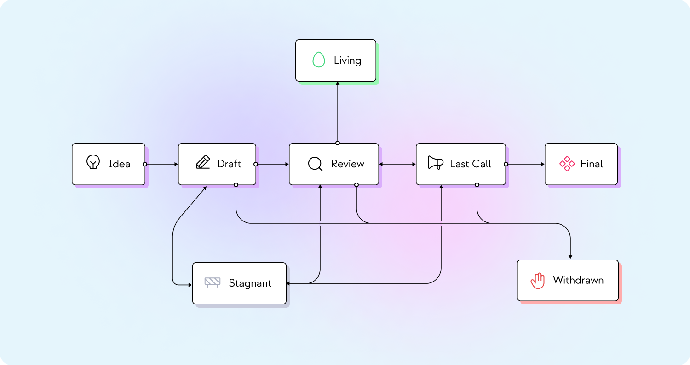

|  pip | title  | status  | type | author  |  created |
|---|---|---|---|---|---|
|  1 |  PIP Purpose and Guidelines | Living | Process |  Harsh Rajat <Harsh@epns.io>, Pranshu Rastogi <Pranshu@epns.io> |  2022-08-07 |

# What is an PIP?

PIP stands for PUSH Improvement Proposal. A PIP is a design document providing information to the Push community, or describing a new feature, processes or environment. The PIP should provide a concise technical specification of the feature and a rationale for the feature. The PIP author is responsible for building consensus within the community and documenting dissenting opinions.

# PIP Rationale

We intend PIPs to be the primary mechanisms for proposing new features, for collecting community technical input on an issue, and for documenting the design decisions that have gone into Push ecosystem. Because the PIPs are maintained as text files in a versioned repository, their revision history is the historical record of the feature proposal.

For Push community, PIPs are a convenient way to track the progress of their implementation. Ideally each implementation maintainer would list the PIPs that they have implemented. This will give end users a convenient way to know the current status of a given implementation or library.

# Understanding PIP Types, Categories, Subcategories and Niche

PIP proposals are classified into **type** which can then optionally be categorized into **category** -> **subcategory** -> **niche**. Type describes the high level standard which the PIP wants to address. Category describes the type drilldown which a specific PIP is created to address. Subcategory dives deeper into a particular category while niche describes the low level component of that subcategory.

Please see [definitions](../../definitions) to learn more about them.

### Type

Type decribes the high level standard which the PIP wants to improve.

1. **Standard**  PIP describes any change that affects most or all Push protocol implementations, such as changes in core, interface, networking or application level standards.

2. **Meta** PIP describes a process surrounding Push or proposes a change to (or an event in) a process. Process PIPs are like Standards Track PIPs but apply to areas other than the Push protocol itself. Examples include procedures, guidelines, changes to the decision-making process, and changes to the tools or environment used in Push development. Any meta-PIP is also considered a Process PIP.

3. **Informational** PIP provides general guidelines or information to the PUSH community, but does not propose a new feature. Informational PIPs do not necessarily represent a PUSH community consensus or recommendation, so users and implementors are free to ignore Informational PIPs or follow their advice.

### Category

Categories are only required for **Standard** Type PIPs and define the branch of PUSH Protocol which it targets to improve.

1. **Core**: includes improvements for changes in the network including incentives and rewards, syncing, consensus mechanism changes and processes that might require fork cause of breaking changes.

2. **Interface**: includes improvements around client API/RPC specifications and standards, and also certain language-level standards that may help in standardizing interfacing.

3. **Networking**: includes networking specifications and proposals around how push nodes communicate and interoperate.

4. **PRC**: Signifies, application-level standards and conventions, including verification, identity, payloads, content markdown for notifications, chats or any communication standard that is added.

### Subcategory

Subcategory are optional and mainly required for **PRC** category, they define the particular topic within the Category.

1. **Notification**: Available under Standard > PRC > Notification which addresses specs, proposals and improvements for everything related to push notification protocol.

2. **Chat**: Available under Standard > PRC > Chat which addresses spec, proposals and improvements for everything related to push chat protocol.

### Niche

Niche are optional and are required in some **Subcateory** sections. they define the specific low level funcationality that needs to be changed, improved or addressed.

For Subcategory: **Nofification**

1. **Verification**: Addresses different types of verifications that can be used while sending a notification to Push node.

2. **Identity**: Identitifies from where a notification payload is coming along with what is the storage mode, protocol to transform it to json payload, etc.

3. **payload**: Addresses what payload of the notification should contain including the way notification should be encrypted, things payload can carry and how they transform and the recipients for which it is intended to be.

4. **content**: Defines how content inside the notfication can be displayed, mostly markdown for title and the body of notification.

For Subcategory: **Chat**

{TBD}

### Important

It is highly recommended that a single PIP contain a single key proposal or new idea. The more focused the PIP, the more successful it tends to be. e.g. - A typo or single change in payloads doesn't require PIP. It should be contributing as major improvement or change multiple clients.

A PIP must meet certain minimum criteria. It must be a clear and complete description of the proposed enhancement. The enhancement must represent a net improvement. The proposed implementation, if applicable, must be solid and must not complicate the protocol unduly.

# PIP Process

The following is the standardization process for all Push Protocol Standards Improvement Proposals:



**Idea** - An idea that is pre-draft. It can be done over [Push Discord](https://discord.com/invite/YVPB99F9W5) or [Push Forum](https://gov.push.org/c/pip/29) .

**Draft** - The first formally tracked stage of a proposal in development. To create draft, you should submit PR request against an issue in
`PIPs` repository. Make sure, draft should be in respective payload standards subdirectory.

**Last Call** - This is the final review window for an PIP before moving to Final. A PIP editor will assign Last Call status and set a review end date (last-call-deadline), typically 14 days later.

If this period results in necessary normative changes it will revert the PIP to Review.

**Review** - An Author marks a proposal as ready for and requesting Peer Review. This is the final window for proposal before moving to final.

**Final** - This represents the final standard. A Final proposal exists in a state of finality and should only be updated to correct errata and add non-normative clarifications.

**Stagnant** - Any proposal in Draft or Review or Last Call if inactive for a period of 4 months or greater is moved to Stale. The proposal may be resurrected from this state by Authors or  Editors through moving it back to Draft or it's earlier status. If not resurrected, a proposal may stay forever in this status.

**Withdrawn** - The  Author(s) have withdrawn the proposed submission. This state has finality and can no longer be resurrected using this proposal number. If the idea is pursued at later date it is considered a new proposal.

**Living** - A special status for PIPs that are designed to be continually updated and not reach a state of finality. This includes most notably PIP-1.

## What belongs in a successful Push Protocol Standards Improvement Proposal?

Each Proposal should have the following parts:

* **Abstract** - Abstract is a multi-sentence (short paragraph) technical summary. This should be a very terse and human-readable version of the specification section. Someone should be able to read only the abstract to get the gist of what this specification does.

* **Motivation**  - A motivation section is critical for Proposals that want to change or amend the Standards. It should clearly explain why the existing Standard specification is inadequate to address the problem that the proposed solves. Proposals without sufficient motivation may be rejected outright.

* **Specification** - The technical specification should describe the syntax and semantics of any new feature.

* **Rationale** (*optional)- The rationale fleshes out the specification by describing what motivated the design and why particular design decisions were made. It should describe alternate designs that were considered and related work. The rationale should discuss important objections or concerns raised during discussion around the Proposal.

* **Reference Implementation** (*Optional)- An optional section that contains a reference/example implementation that people can use to assist in understanding or implementing this specification.

# PIP Formats and Templates -

PIPs should be written in [markdown](https://github.com/adam-p/markdown-here/wiki/Markdown-Cheatsheet) format. There is a [template](../../pip-template.md) to follow.

# Linking to External Resources

Links to external resources SHOULD NOT be included. External resources may disappear, move, or change unexpectedly.

# Linking to other PIPs

References to other PIPs should follow the format PIP-N where N is the PIP number you are referring to. Each PIP that is referenced in an PIP MUST be accompanied by a relative markdown link the first time it is referenced, and MAY be accompanied by a link on subsequent references. The link MUST always be done via relative paths so that the links work in this GitHub repository, forks of this repository, the main PIPs site, mirrors of the main PIP site, etc. For example, you would link to this PIP with [PIP-1](./pip-1-workflow-index.md).

# Auxiliary Files

Images, diagrams and auxiliary files should be included in a subdirectory of the assets folder for that EIP as follows: assets/pip-N (where N is to be replaced with the PIP number). When linking to an image in the PIP, use relative links such as ../assets/pip-1/image.png.

# Transferring PIP Ownership

It occasionally becomes necessary to transfer ownership of PIPs to a new champion. In general, we'd like to retain the original author as a co-author of the transferred PIP, but that's really up to the original author. A good reason to transfer ownership is because the original author no longer has the time or interest in updating it or following through with the PIP process, or has fallen off the face of the 'net (i.e. is unreachable or isn't responding to email). A bad reason to transfer ownership is because you don't agree with the direction of the PIP. We try to build consensus around an PIP, but if that's not possible, you can always submit a competing PIP.

If you are interested in assuming ownership of an PIP, send a message asking to take over, addressed to both the original author and the PIP editor. If the original author doesn't respond to the email in a timely manner, the PIP editor will make a unilateral decision (it's not like such decisions can't be reversed :)).

# PIP Editors

The current PIP editors are -

* Harsh Rajat [@harshrajat](https://twitter.com/harshrajat)
* Pranshu Rastogi [@pranshu3196](https://twitter.com/pranshu3196)

# PIP Editor Responsibilities

For each new PIP that comes in, an editor does the following:

```
* Read the PIP to check if it is ready: sound and complete. The ideas must make technical sense, even if they don't seem likely to get to final status.
* The title should accurately describe the content.
* Check the PIP for language (spelling, grammar, sentence structure, etc.), markup (GitHub flavored Markdown), code style
* If the PIP isn't ready, the editor will send it back to the author for revision, with specific instructions.
```

Once the PIP is ready for the repository, the PIP editor will:

```
* Assign an PIP number (generally the PR number, but the decision is with the editors)
* Merge the corresponding pull request
* Send a message back to the PIP author with the next step.
* The PIP editors monitor PIP changes, and correct any structure, grammar, spelling, or markup mistakes we see.
```

# History

This document was derived heavily from [Ethereum's EIP-1](https://eips.ethereum.org/EIPS/eip-1), which was derived heavily from [Bitcoin's BIP-0001](https://github.com/bitcoin/bips) written by Amir Taaki which in turn was derived from [Python's PEP-0001](https://www.python.org/dev/peps/). The bulk of the text was copied from [Ethereum's EIP-1] and modified as necessary. Although the PEP-0001 text was written by Barry Warsaw, Jeremy Hylton, and David Goodger,
they are not responsible for its use in the Push Improvement Proposals (PIPs), and should not be bothered with technical questions specific to **Push**, **Push Protocol** or the **PIP**. Please direct all comments to the [PIP editors](https://github.com/ethereum-push-notification-service/PIPs#pips-standards-editors).
